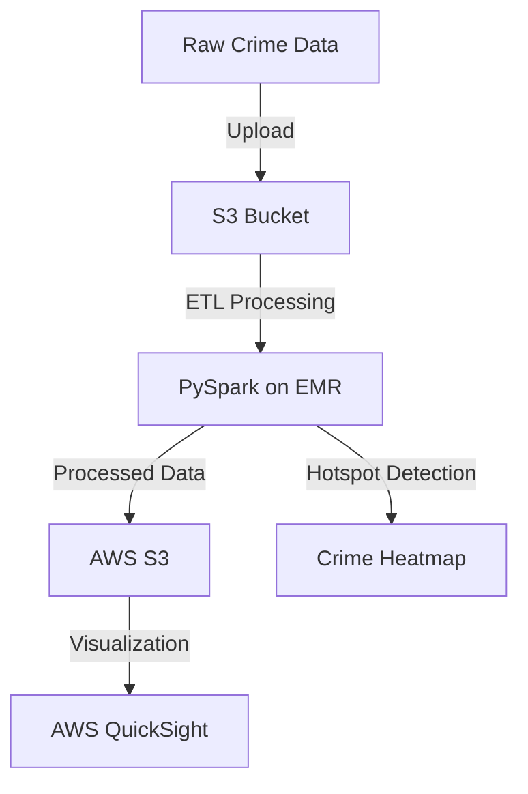

# Predictive-Crime-Mapping-Using-Cloud-Analytics
# 🚔 Crime Hotspot Detection Using Big Data & AWS

## 📌 Project Overview
This project analyzes crime data using **Big Data processing tools** and **AWS services** to visualize crime hotspots effectively. By leveraging **PySpark, AWS S3, AWS EMR, and AWS QuickSight**, the project identifies high-crime areas, enabling law enforcement and policymakers to make data-driven decisions.

---

## ⚡ Key Features
- **Crime Data Processing:** Extracts, cleans, and transforms crime records using PySpark.
- **Big Data Storage:** Stores structured data in **AWS S3** for scalability and accessibility.
- **Data Processing & Analytics:** Uses **AWS EMR (Elastic MapReduce)** for distributed crime data processing.
- **Crime Hotspot Visualization:** Generates interactive heatmaps and trend analysis using **AWS QuickSight**.
- **Trend Analysis & Insights:** Analyzes crime patterns over time for better crime prevention strategies.

---

## 🏗️ Project Architecture


---

## 🔧 Tech Stack
- **Programming:** Python, PySpark
- **Big Data Processing:** Apache Spark
- **Cloud Services:** AWS S3, AWS EMR, AWS QuickSight
- **Visualization:** Matplotlib, AWS QuickSight

---

## 🚀 Installation & Setup

### 1️⃣ Clone the Repository
```bash
git clone https://github.com/yourusername/crime-hotspot-detection.git
cd crime-hotspot-detection
```

### 2️⃣ Install Dependencies
```bash
pip install -r requirements.txt
```

### 3️⃣ Set Up AWS Credentials
- Configure AWS CLI with your credentials:
```bash
aws configure
```
- Ensure IAM roles have access to **S3, EMR, and QuickSight**.

### 4️⃣ Upload Data to S3
```bash
aws s3 cp crime_data.csv s3://your-bucket-name/
```

### 5️⃣ Run PySpark Job on EMR
```bash
spark-submit crime_analysis.py
```

### 6️⃣ Visualize in AWS QuickSight
- Go to AWS QuickSight → Create a Dataset → Select S3 Data
- Build **Crime Hotspot Heatmaps** and **Trend Graphs**

---

## 📊 Results & Insights
✅ Identified crime-prone areas in major cities.
✅ Detected seasonal trends in criminal activities.
✅ Provided interactive **heatmaps & graphs** for data-driven decisions.

---

## 📁 Project Structure
```
crime-hotspot-detection/
│-- data/
│   ├── raw_crime_data.csv
│   ├── processed_crime_data.csv
│-- src/
│   ├── crime_analysis.py
│   ├── data_cleaning.py
│-- notebooks/
│   ├── exploratory_analysis.ipynb
│-- reports/
│   ├── crime_hotspot_visualization.pdf
│-- README.md
│-- requirements.txt
```

---

## 🤝 Contributing
Feel free to contribute! Fork this repo, create a branch, and submit a PR.


---

## 📬 Contact
📧 Email: srinivasnarayanaramm@email.com  
🔗 GitHub: https://github.com/srinivas873 
🔗 LinkedIn: https://www.linkedin.com/feed/

---

🚀 **Happy Coding!**
