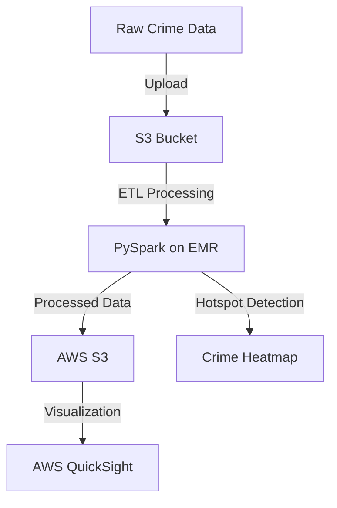

# 🚔 Predictive Crime Mapping Using Cloud Analytics

## 📌 Project Overview
This project leverages **Big Data processing** and **AWS services** to analyze and visualize crime hotspots efficiently. The goal is to help law enforcement and policymakers identify high-crime areas and make data-driven decisions. 

We use **PySpark, AWS S3, AWS EMR, and AWS QuickSight** for scalable data processing and interactive visualizations.

---

## ⚡ Key Features
- **Crime Data Processing:** Extract, clean, and transform crime records using PySpark.
- **Big Data Storage:** Use AWS S3 to store large datasets for scalable access.
- **Distributed Data Processing:** Utilize AWS EMR to handle crime data at scale.
- **Crime Hotspot Visualization:** Generate interactive heatmaps and trend analysis using AWS QuickSight.
- **Trend Analysis:** Identify crime patterns and seasonal trends for better decision-making.

---

## 🏗️ Project Architecture


---

## 🔧 Tech Stack
- **Programming:** Python, PySpark
- **Big Data Processing:** Apache Spark
- **Cloud Services:** AWS S3, AWS EMR, AWS QuickSight
- **Visualization:** Matplotlib, Streamlit, AWS QuickSight

---

## 📂 Project Structure
```
crime-hotspot-detection/
│-- notebooks/
│   ├── Crime_Rates_Final.ipynb
│   ├── Visualizing_the_Crime_Data.ipynb
│-- scripts/
│   ├── Streamlit_Dashboard.py
│-- data/
│   ├── crime_data.csv
│   ├── statelatlong.csv
│   ├── manifest.json
│-- reports/
│   ├── Final_report.pdf
│-- README.md
│-- requirements.txt
```

---

## 🚀 Installation & Setup

### 1️⃣ Clone the Repository
```bash
git clone https://github.com/yourusername/crime-hotspot-detection.git
cd crime-hotspot-detection
```

### 2️⃣ Install Dependencies
```bash
pip install -r requirements.txt
```

### 3️⃣ Set Up AWS Credentials
- Configure AWS CLI with your credentials:
```bash
aws configure
```
- Ensure IAM roles have access to **S3, EMR, and QuickSight**.

### 4️⃣ Upload Data to S3
```bash
aws s3 cp data/crime_data.csv s3://your-bucket-name/
```

### 5️⃣ Run PySpark Job on EMR
```bash
spark-submit scripts/crime_analysis.py
```

### 6️⃣ Run Streamlit Dashboard
```bash
streamlit run scripts/Streamlit_Dashboard.py
```

### 7️⃣ Visualize in AWS QuickSight
- Go to AWS QuickSight → Create a Dataset → Select S3 Data
- Build **Crime Hotspot Heatmaps** and **Trend Graphs**

---

## 📊 Results & Insights
✅ Identified high-crime areas with heatmaps.
✅ Detected seasonal crime trends for predictive insights.
✅ Provided interactive **visualizations & dashboards**.

---

## 🤝 Contributing
Feel free to contribute! Fork this repo, create a branch, and submit a PR.


---

## 📬 Contact
📧 Email: srinivasnarayanaramm@email.com  
🔗 GitHub: https://github.com/srinivas873 
🔗 LinkedIn: https://www.linkedin.com/feed/

---

🚀 **Happy Coding!**
